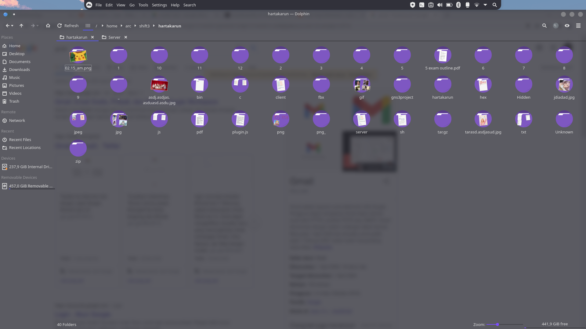
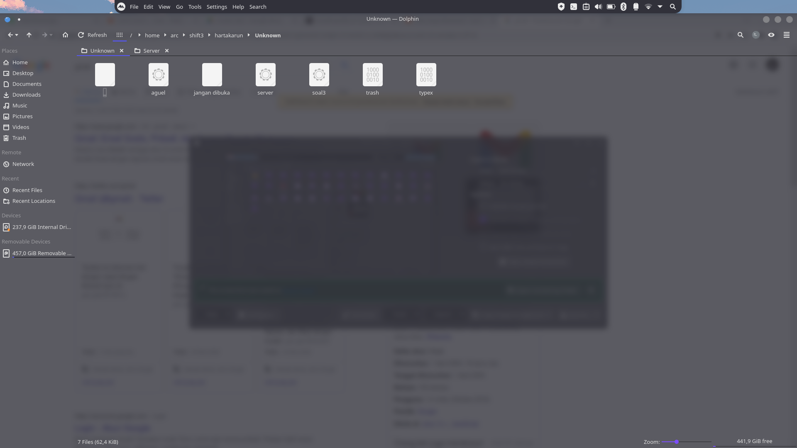
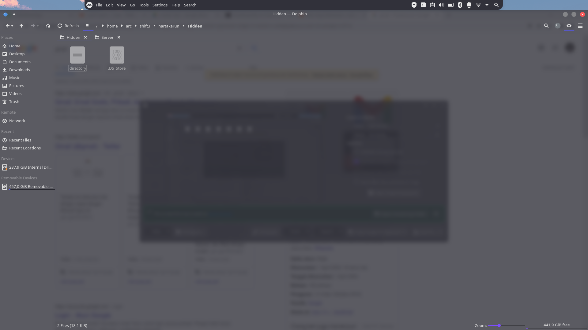

# Laporan Resmi Praktikum Modul 3 Kelompok B05 Sistem Operasi B Tahun 2022   
  
Nama Lengkap | NRP
------------- | -------------
Fahmi Muhazir        | 5025201043
Sidrotul Munawaroh   | 5025201047
Rere Arga Dewanata   | 5025201078 

## Soal 1  
Novak adalah seorang mahasiswa biasa yang terlalu sering berselancar di internet. Pada suatu saat, Ia menemukan sebuah informasi bahwa ada suatu situs yang tidak memiliki pengguna. Ia mendownload berbagai informasi yang ada dari situs tersebut dan menemukan sebuah file dengan tulisan yang tidak jelas. Setelah diperhatikan lagi, kode tersebut berformat base64. Ia lalu meminta kepada anda untuk membuat program untuk memecahkan kode-kode di dalam file yang Ia simpan di drive dengan cara decoding dengan base 64. Agar lebih cepat, Ia sarankan untuk menggunakan thread.

### Kendala Soal 1  
Masih kesulitan untuk melakukan decode base64, sehingga harus mencari referensi ke internet.  

### Screenshot Soal 1  
Isi folder "quote"
  
Isi folder "music"  
  
Isi folder "hasil"  
  
Hasil decode base64 pada file "music.txt"  
  
Hasil decode base64 pada file "quote.txt"  
  
Tampilan keseluruhan file dan folder  
  
Isi dari "hasil.zip"  
  
Isi pada folder "hasil" di "hasil.zip"  
  
Isi dari "no.txt"  
  
Password dibutuhkan untuk unzip file "hasil.zip"  
      

### 1A
**Deskripsi Soal**  
Download file music.zip dan quote.zip kemudian extract isinya ke dalam folder "quote" dan  "music".   

**Kode Program Fungsi Main**  
```
    /*
        Soal 1A:
        Download file music.zip dan quote.zip kemudian extract isinya ke dalam folder "quote" dan  "music"
    */

        // Download Zip 
    int err1;
    for (int i = 0; i < 2; i++)
    {
        err1 = pthread_create(&(download_id[i]),NULL,&download_zip,NULL);
    }

    for (int j = 0; j < 2 ; j++)
    {
        pthread_join(download_id[j], NULL);
    }

        // Make Directory 
    int err2;
    for (int i = 0; i < 3; i++)
    {
        err2 = pthread_create(&(makedir_id[i]), NULL, &makedir, NULL); 
    }
    
    for (int j = 0; j < 3; j++)
    {
        pthread_join(makedir_id[0], NULL);
    }
    
        // Unzip and Move to new directory
    int err3;
    for (int i = 0; i < 2; i++)
    {
        err3 = pthread_create(&(unzip_id[i]), NULL, &unzip, NULL); 
    }
    
    for (int j = 0; j < 2;j++ )
    {
        pthread_join(unzip_id[j], NULL);
    }

```  
**Penjelasan Kode Program Fungsi Main**  
Membuat thread untuk melakukan download zip, membuat directory baru, dan unzip. Thread dibuat menggunakan `pthread_create` Setiap thread tersebut setelah dibuat akan digabungkan menggunakan `pthread_join`.  

**Kode Program Fungsi download_zip**  
```
void *download_zip(void *arg)
{   
    int status;
    pthread_t id = pthread_self();
    if (pthread_equal(id, download_id[0]))
    {
        pid_t child_download_music;
        child_download_music = fork();
        if (child_download_music < 0)
        {
            exit(EXIT_FAILURE);
        }
        else if (child_download_music == 0)
        {
            char *argv[] = {"wget", "-O", zip_name_music, link_music,  NULL};
            execv("/bin/wget",argv);
        }
        while ((wait(&status)) > 0);
    }
    else if (pthread_equal(id, download_id[1]))
    {
        pid_t child_download_quote;
        child_download_quote = fork();
        if (child_download_quote < 0)
        {
            exit(EXIT_FAILURE);
        }
        else if (child_download_quote == 0)
        {
            char *argv[] = {"wget", "-O", zip_name_quote, link_quote,  NULL};
            execv("/bin/wget",argv);
        }
        while ((wait(&status)) > 0);
    }
}
```
**Penjelasan Kode Program Fungsi download_zip**  
Sesuai dengan namanya, fungsi ini digunakan untuk mendownload zip dari internet. Agar dapat dilakukan secara bersamaan, digunakanlah thread. Untuk downloadnya sendiri, digunakan `wget` dengan parameter `-O` agar dapat disimpan dengan nama yang berbeda.  

**Kode Program Fungsi makedir**  
```
void *makedir(void *arg)
{
    int status;
    pthread_t id = pthread_self();
    if (pthread_equal(id, makedir_id[0])) 
    {
        pid_t child_mkdir_music;
        child_mkdir_music = fork();
        if (child_mkdir_music < 0)
        {
            exit(EXIT_FAILURE);
        }
        else if (child_mkdir_music == 0)
        {
            char *argv[] = {"mkdir", "-p",  folder_name_music, NULL};
            execv("/bin/mkdir", argv);
        }
        while ((wait(&status)) > 0);
    }
    else if (pthread_equal(id, makedir_id[1]))
    {
        pid_t child_mkdir_quote;
        child_mkdir_quote = fork();
        if (child_mkdir_quote < 0)
        {
            exit(EXIT_FAILURE);
        }
        if (child_mkdir_quote == 0)
        {
            char *argv[] = {"mkdir", "-p",  folder_name_quote, NULL};
            execv("/bin/mkdir", argv);
        }
        while ((wait(&status)) > 0);
    }
    else if (pthread_equal(id, makedir_id[2])) 
    {
        pid_t child_mkdir_hasil;
        child_mkdir_hasil = fork();
        if (child_mkdir_hasil < 0)
        {
            exit(EXIT_FAILURE);
        }
        else if (child_mkdir_hasil == 0)
        {
            char *argv[] = {"mkdir", "-p",  folder_name_hasil, NULL};
            execv("/bin/mkdir", argv);
        }
        while ((wait(&status)) > 0);
    }
}
```  

**Penjelasan Kode Program Fungsi makedir**  
Sesuai dengan namanya, fungsi ini digunakan untuk membuat directory baru, dalam hal ini directory "music","quote", dan "hasil". Agar dapat dilakukan secara bersamaan, digunakanlah thread. Untuk membuat directory, digunakan perintah `mkdir` dengan parameter `-p` agar mampu membuat sekaligus parent directorynya.  

**Kode Program Fungsi unzip**    
```
void *unzip(void *arg)
{
    int status;
    pthread_t id = pthread_self();
    if (pthread_equal(id,unzip_id[0])) 
    {
        pid_t child_unzip_music;
        child_unzip_music = fork();
        if (child_unzip_music < 0)
        {
            exit(EXIT_FAILURE);
        }
        if (child_unzip_music == 0)
        {
            char *argv[] = {"unzip", "-o", zip_name_music, "-d", folder_name_music, NULL};
            execv("/bin/unzip", argv);
        }
        while ((wait(&status)) > 0);
    }
    else if (pthread_equal(id,unzip_id[1]))
    {
        pid_t child_unzip_quote;
        child_unzip_quote = fork();
        if (child_unzip_quote < 0)
        {
            exit(EXIT_FAILURE);
        }
        else if (child_unzip_quote == 0)
        {
            char *argv[] = {"unzip", "-o", zip_name_quote, "-d", folder_name_quote, NULL};
            execv("/usr/bin/unzip", argv);
        }
        while ((wait(&status)) > 0);
    }
}
```  

**Penjelasan Kode Program Fungsi unzip**  
Sesuai dengan namanya, fungsi ini digunakan untuk melakukan unzip pada file yang telah di-download sebelumnya. Agar dapat dilakukan secara bersamaan, digunakanlah thread. Untuk melakukan unzip, digunakan perintah `unzip` dengan menerima paramater `-o` agar mampu melakukan unzip tanpa prompt dan paramater `-d`agar mampu melakukan unzip ke directory yang berbeda.  

### 1B  
**Deskripsi Soal**  
Melakukan decode hasil extract pada folder "music" dan "quote" menggunakan Base64. Kemudian, masukkan hasil decode-nya ke dalam file text yang baru pada masing masing folder.  

**Kode Program Fungsi Main**  
```
/*
    Soal 1B:
    Decode hasil extract pada folder "music" dan "quote" menggunakan Base64.
    Kemudian, masukkan hasil decode-nya ke dalam file text yang baru pada masing masing folder
*/

int err4;
for (int i = 0; i < 2; i++)
{
    err4 = pthread_create(&(decode_id[i]), NULL, &decode_base64text, NULL); 
}

for (int j = 0; j < 2; j++)
{
    pthread_join(decode_id[j], NULL);
}

```  
**Penjelasan Kode Program Fungsi Main**  
Membuat thread untuk melakukan decode. Thread dibuat menggunakan `pthread_create` Setiap thread tersebut setelah dibuat akan digabungkan menggunakan `pthread_join`.  

**Kode Program Untuk Decode Base64**
```
void decodeblock(unsigned char in[], char *clrstr)
{
    unsigned char out[4];
    out[0] = in[0] << 2 | in[1] >> 4;
    out[1] = in[1] << 4 | in[2] >> 2;
    out[2] = in[2] << 6 | in[3] >> 0;
    out[3] = '\0';
    strncat(clrstr, out, sizeof(out));
}

void b64_decode(char *b64src, char *clrdst)
{
    int c, phase, i;
    unsigned char in[4];
    char *p;

    clrdst[0] = '\0';
    phase = 0;
    i = 0;
    while (b64src[i])
    {
        c = (int)b64src[i];
        if (c == '=')
        {
            decodeblock(in, clrdst);
            break;
        }
        p = strchr(b64, c);
        if (p)
        {
            in[phase] = p - b64;
            phase = (phase + 1) % 4;
            if (phase == 0)
            {
                decodeblock(in, clrdst);
                in[0] = in[1] = in[2] = in[3] = 0;
            }
        }
        i++;
    }
}

void *decode_base64text(void *arg)
{
    FILE *ptr, *musicDec, *quoteDec;
    char str[100];
    char temp[100];

    pthread_t id = pthread_self();
    if (pthread_equal(id, decode_id[0]))
    {
        for (int i = 1; i < 10; i++)
        {
            sprintf(temp, "/home/argadewanata/SistemOperasi/Modul3/music/m%d.txt", i);
            ptr = fopen(temp, "r");
            while (fgets(str, 100, ptr) != NULL)
            {
                char mydst[1024] = "";
                b64_decode(str, mydst);
                musicDec = fopen("/home/argadewanata/SistemOperasi/Modul3/music/music.txt", "a");
                fprintf(musicDec, "%s\n", mydst);
            }
            fclose(ptr);
            fclose(musicDec);
        }
    }
    else if (pthread_equal(id, decode_id[1]))
    {
        for (int i = 1; i < 10; i++)
        {
            sprintf(temp, "/home/argadewanata/SistemOperasi/Modul3/quote/q%d.txt", i);
            ptr = fopen(temp, "r");
            while (fgets(str, 100, ptr) != NULL)
            {
                char mydst[1024] = "";
                b64_decode(str, mydst);
                quoteDec = fopen("/home/argadewanata/SistemOperasi/Modul3/quote/quote.txt", "a");
                fprintf(quoteDec, "%s\n", mydst);
            }
            fclose(ptr);
            fclose(quoteDec);
        }
    }
}
```  
**Penjelasan Kode Program Untuk Decode Base64**  
Untuk men-decode base64, kelompok kami mengambil referensi dari web ini https://fm4dd.com/programming/base64/base64_stringencode_c.shtm. Akan tetapi, untuk pembacaan setiap file-nya kami membuat fungsi sendiri, yaitu decode_base64text. Fungsi decode_base64text berguna untuk melakukan decode tiap iterasi item pada folder "quote" dan "music" dan hasilnya dimasukkan ke dalam file "music.txt" dan "quote.txt".  

### 1C
**Deskripsi Soal**  
Memindahkan  file "quote.txt" dan "music.txt" ke folder "hasil"  

**Kode Program Untuk Fungsi Main**  
```
/*
    Soal 1C:
    Memindahkan  file "quote.txt" dan "music.txt" ke folder "hasil"
*/

int err5;
for (int i = 0; i < 2; i++)
{
    err5 = pthread_create(&(move_id[i]), NULL, &move, NULL); 
}

for (int j = 0;j < 2 ; j++)
{
    pthread_join(move_id[j], NULL);
}

```  
**Penjelasan Kode Program Fungsi Main**   
Membuat thread untuk melakukan pemindahan file. Thread dibuat menggunakan `pthread_create` Setiap thread tersebut setelah dibuat akan digabungkan menggunakan `pthread_join`.  

**Kode Program Untuk Fungsi Move**  
```
void *move(void *arg)
{
    int status;    
    pthread_t id = pthread_self();
    if (pthread_equal(id, move_id[0]))
    {
        pid_t child_move_quote;
        child_move_quote = fork();
        if(child_move_quote < 0 )
        {
            exit(EXIT_FAILURE);
        }
        else if (child_move_quote == 0)
        {
            char *argv[] = {"mv",file_name_quote,folder_name_hasil,NULL};
            execv("/bin/mv", argv);
        }
        while ((wait(&status)) > 0);
    }
    else if (pthread_equal(id, move_id[1])) 
    {
        pid_t child_move_music;
        child_move_music = fork();
        if(child_move_music < 0 )
        {
            exit(EXIT_FAILURE);
        }
        else if (child_move_music == 0)
        {
            char *argv[] = {"mv",file_name_music,folder_name_hasil,NULL};
            execv("/bin/mv", argv);
        }
        while ((wait(&status)) > 0);
    }
}
```  

**Penjelasan Kode Program Fungsi Move**  
Sesuai dengan namanya, fungsi ini digunakan untuk melakukan pemindahan file "music.txt" dan "quote.txt" ke dalam folder "hasil". Agar dapat dilakukan secara bersamaan, digunakanlah thread. Untuk melakukan pemindahan file, digunakan perintah `mv`.  

### 1D  

**Deskripsi Soal**  
Melakukan zip pada folder "hasil " dan memberikan password berupa "mihinomenestargadewanata".  

**Kode Program Fungsi zip_hasil**  
```
void *zip_hasil()
{
    int status;
    chdir("/home/argadewanata/'modul 3'");
    pid_t child_zip_hasil;
    child_zip_hasil= fork();
    if (child_zip_hasil < 0)
    {
        exit(EXIT_FAILURE);
    }
    else if (child_zip_hasil == 0)
    {
        char *argv[] = {"zip", "-P", "mihinomenestargadewanata", "-r","hasil.zip","hasil",NULL};
        execv("/bin/zip", argv);
    }
    while ((wait(&status)) > 0);
}
```  

**Penjelasan Kode Program Fungsi zip_hasil**  
Sesuai dengan namanya, fungsi ini digunakan untuk melakukan zip pada folder "hasil" menjadi "hasil.zip" yang dilindungi oleh password "mihinomenestargadewanata".Untuk melakukan zip, digunakan perintah `zip` dengan menerima parameter `-P` agar zip memiliki password dan parameter `-r` agar mampu melakukan zip pada directory.  

### 1E  

**Deskripsi Soal**  
Unzip file "hasil.zip" dan buat file "no.txt" yang berisi tulisan "No" pada saat yang bersamaan. Lalu, lakukan zip kembali pada folder "hasil" dan file "no.txt" dengan tetap memiliki password "mihinomenestargadewanata".  

**Kode Program Fungsi Main**  
```
/*
    Soal 1E:
    Unzip file "hasil.zip" dan buat file "no.txt" yang berisi tulisan "No" secara bersamaan.
    Lalu, zip lagi dengan ketentuan yang sama seperti sebelumnya
*/
    // Unzip  and create "no.txt"   
int err6;
for (int i = 0; i < 3; i++)
{
    err6 = pthread_create(&(unzip2_id[i]), NULL, &unzip_hasil, NULL); 
}

for (int j = 0; j < 3; j++)
{
    pthread_join(unzip2_id[j], NULL);
}
    // Zip again
int err7;
for (int i = 0; i < 2; i++)
{
    err7 = pthread_create(&(zip_id[i]), NULL, &zip_hasil_again,NULL); 
}

for (int j = 0; j < 2; j++)
{
    pthread_join(zip_id[j], NULL);
}

```  
**Penjelasan Kode Program Fungsi Main**  
Membuat thread untuk melakukan unzip, membuat file "no.txt", dan zip kembali. Thread dibuat menggunakan `pthread_create` Setiap thread tersebut setelah dibuat akan digabungkan menggunakan `pthread_join`.  

**Kode Program Fungsi unzip_hasil**  
```
void *unzip_hasil(void *arg)
{
    int status;
    pthread_t id = pthread_self();
    if(pthread_equal(id,unzip2_id[0]))
    {
        pid_t  child_remove_olddir_hasil;
        child_remove_olddir_hasil = fork();
        if(child_remove_olddir_hasil < 0 )
        {
            exit(EXIT_FAILURE);
        }
        else if(child_remove_olddir_hasil == 0)
        {
            char *argv[]={"rm","-r","hasil", NULL};
            execv("/bin/rm",argv);
        }
        while ((wait(&status)) > 0);
    }
    else if(pthread_equal(id,unzip2_id[1])){
        pid_t child_unzip_hasil;
        child_unzip_hasil = fork();
        if(child_unzip_hasil < 0 )
        {
            exit(EXIT_FAILURE);
        }
        else if(child_unzip_hasil == 0){
            usleep(1000);
            char *argv[] = {"unzip", "-P", "mihinomenestargadewanata", "-qq", "hasil.zip", NULL};
            execv("/bin/unzip", argv);
        }
        while ((wait(&status)) > 0);
    }
    else if(pthread_equal(id,unzip2_id[2])){
        FILE *fp1 = fopen("no.txt", "a");
        fprintf(fp1,"No");
        fclose(fp1);
    }
}
```  
**Penjelasan Kode Program fungsi unzip_hasil**  
Tidak hanya mampu unzip "hasil.zip", fungsi ini juga mampu untuk membuat file "no.txt" sekaligus mengisinya. Agar dapat dilakukan secara bersamaan, digunakanlah thread. Agar tidak terjadi kebingungan, folder "hasil" yang lama akan dihapus dengan perintah `rm` lalu dilakukan unzip dengan perintah `unzip`. Selain itu, juga terjadi proses pembuatan file "no.txt" sekaligus dilakukan penulisan di file tersebut.  

**Kode Program fungsi zip_hasil_again**  
```
void *zip_hasil_again(void *arg)
{
    int status;
    pthread_t id = pthread_self();
    if(pthread_equal(id,zip_id[0]))
    {
        pid_t child_zip_hasil_again;
        child_zip_hasil_again = fork();
        if (child_zip_hasil_again < 0)
        {
            exit(EXIT_FAILURE);
        }
        else if(child_zip_hasil_again == 0)
        {
            char *argv[]={"zip","-P","mihinomenestargadewanata", "-r", "hasil.zip", "hasil", "no.txt", NULL};
            execv("/bin/zip",argv);
        }
        while ((wait(&status)) > 0);
    }
    else if(pthread_equal(id,zip_id[1]))
    {
        pid_t child_remove_old_zip_hasil;
        child_remove_old_zip_hasil = fork();
        if (child_remove_old_zip_hasil < 0)
        {
            exit(EXIT_FAILURE);
        }
        else if(child_remove_old_zip_hasil == 0)
        {
            char *argv[]={"rm","-r","hasil.zip", NULL};
            execv("/bin/rm",argv);
        }
        while ((wait(&status)) > 0);
    }
}
```
**Penjelasan Kode Program fungsi zip_hasil_again**      
Tidak hanya mampu melakukan zip kembali, fungsi ini juga dapat menghapus file "hasil.zip" yang lama. Agar dapat dilakukan secara bersamaan, digunakanlah thread. Untuk melakukan zip, digunakan perintah `zip` dengan menerima parameter `-P` agar zip memiliki password dan parameter `-r` agar mampu melakukan zip pada directory.  Untuk melakukan penghapusan file "hasil.zip" yang lama digunakan perintah `rm`.    

## Soal 2  
Bluemary adalah seorang Top Global 1 di salah satu platform online judge. Suatu hari Ia ingin membuat online judge nya sendiri, namun dikarenakan Ia sibuk untuk mempertahankan top global nya, maka Ia meminta kamu untuk membantunya dalam membuat online judge sederhana. Online judge sederhana akan dibuat dengan sistem client-server dengan beberapa kriteria sebagai berikut:


### Screenshot  
  
  
  
  
  
  
  

    


### 2A
**Deskripsi Soal**
Membuat register dan login pada saat client terhubung ke server, dan client akan diminta id dan password untuk dikirim ke server, dan input datanya akan disimpan ke file users.txt dengan format username:password
dengan Username unique (tidak boleh ada user yang memiliki username yang sama), Password minimal terdiri dari 6 huruf, terdapat angka, terdapat huruf besar dan kecil

```
int validateUsername(FILE *fptr, char *username)
{
    char buffer[200];
    while (fscanf(fptr, "%s", buffer) != EOF)
    {
        char *token = strtok(buffer, ":");
        if (!strcmp(username, token))
        {
            return 1;
        }
    }
    return 0;
}
 
int validatePassword(char *password)
{
    // check for length, number, uppercase, and lowercase character
    int c_num = 0, c_upp = 0, c_low = 0;
    if (strlen(password) < 6)
        return 1;
    for (int i = 0; password[i] != '\0'; i++)
    {
        c_num = c_num || isdigit(password[i]);
        c_upp = c_upp || (isalpha(password[i]) && password[i] == toupper(password[i]));
        c_low = c_low || (isalpha(password[i]) && password[i] == tolower(password[i]));
    }
    if (!(c_num && c_upp && c_low))
        return 1;
 
    return 0;
}
 
void handleRegister(int fd, char *username)
{
    FILE *fptr;
    fptr = fopen("users.txt", "a+");
    char password[100];
    if (validateUsername(fptr, username) != 1)
    {
        send(fd, "Masukkan password kamu!", 100, 0);
        read(fd, password, 1024);
        if (validatePassword(password))
        {
            send(fd, "Password belum sesuai persyaratan!", 100, 0);
        }
        printf("uname %s\n", username);
        printf("pass %s\n", password);
        fprintf(fptr, "%s:%s\n", username, password);
        fclose(fptr);
        return;
    }
    else
    {
        send(fd, "Username sudah ada dalam database!", 100, 0);
        close(fd);
        exit;
    }
}
 
void handleLogin(int fd, char *username)
{
    char password[100];
    send(fd, "Masukkan password kamu!", 100, 0);
    read(fd, password, 1024);
    FILE *fptr = fopen("users.txt", "a+");
    char buffer[100], comp[201];
    snprintf(comp, 201, "%s:%s", username, password);
    while (fscanf(fptr, "%s", buffer) != EOF)
    {
        if (!strcmp(comp, buffer))
        {
            fclose(fptr);
            return;
        }
    }
    send(fd, "Login gagal!", 100, 0);
    fclose(fptr);
}
```

**Penjelasan**
Membuat register dan login, lalu membuat data input yang disimpan ke file users.txt dengan `*fptr` untuk mendeklarasi file pointer


### 2B
**Deskripsi Soal**
Sistem memiliki sebuah database pada server untuk menampung problem atau soal-soal yang ada pada online judge. Database ini bernama problems.tsv yang terdiri dari judul problem dan author problem (berupa username dari author), yang dipisah dengan \t. File otomatis dibuat saat server dijalankan.

```
int validateProblem(char *title)
{
    FILE *tsv = fopen("problems.tsv", "r");
    char buffer[200];
    while (fgets(buffer, 150, tsv))
    {
        buffer[strcspn(buffer, "\n")] = 0;
        char *token = strtok(buffer, "\t");
        if (!strcmp(title, token))
        {
            return 1;
        }
    }
    fclose(tsv);
    return 0;
}
```

**Penjelasan**
Selanjutnya membuat file berextension `.tsv` saat server dijalankan untuk menampung problem dan soal-soal pada online judge

### 2C
**Deskripsi Soal**
Membuat command `add` yang berfungsi untuk menambah problem/soal baru pada sistem Saat client menginputkan command tersebut, server akan meminta beberapa input yaitu:
Judul problem (unique, tidak boleh ada yang sama dengan problem lain)
Path file description.txt pada client (file ini berisi deskripsi atau penjelasan problem)
Path file input.txt pada client (file ini berguna sebagai input testcase untuk menyelesaikan problem)
Path file output.txt pada client (file ini berguna untuk melakukan pengecekan pada submission client terhadap problem)

```
void handleAddProblem(int fd, char *username)
{
    FILE *tsv = fopen("problems.tsv", "a+");
    char judul[150], f_desc[150], f_inp[150], f_out[150], c;
    send(fd, "Masukkan judul problem : ", 150, 0);
    read(fd, judul, 1024);
    if (validateProblem(judul))
    {
        send(fd, "re_inp", 150, 0);
        send(fd, "Judul sudah ada, silakan masukkan ulang", 150, 0);
        sleep(1);
        handleAddProblem(fd, username);
        return;
    }
    send(fd, "Masukkan filepath deskripsi problem : ", 150, 0);
    read(fd, f_desc, 1024);
    send(fd, "Masukkan filepath input problem : ", 150, 0);
    read(fd, f_inp, 1024);
    send(fd, "Masukkan filepath output problem : ", 150, 0);
    read(fd, f_out, 1024);
    fprintf(tsv, "%s\t%s\n", judul, username);
    fclose(tsv);
    mkdir(judul, 0777);
    chdir(judul);
    copyFiles(f_desc, "description.txt");
    copyFiles(f_inp, "input.txt");
    copyFiles(f_out, "output.txt");
}
```

**Penjelasan**
Membuat command add untuk menambahkan problem/soal baru pada sistem dengan 
menggunakan `send` yang berfungsi untuk mengirim pesan hanya ketika socket terhubung 
`read` yang berfungsi untuk membaca data yang sebelum ditulis ke file,
`mkdir` yang berfungsi untuk membuat direktori,
`chdir` yang berfungsi untuk mengubah direktori

### 2D
**Deskripsi Soal**
Client yang telah login, dapat memasukkan command ‘see’ yang berguna untuk menampilkan seluruh judul problem yang ada beserta authornya(author merupakan username client yang menambahkan problem tersebut). Format yang akan ditampilkan oleh server adalah sebagai berikut:

```
void handleSeeProblem(int fd, char *username)
{
    char cwd[200];
    if (getcwd(cwd, sizeof(cwd)) != NULL)
    {
        printf("Current working dir: %s\n", cwd);
    }
    FILE *tsv = fopen("problems.tsv", "a+");
    char buffer[1000], c;
    c = fgetc(tsv);
    while (c != EOF)
    {
        if (c == '\t')
        {
            strcat(buffer, " by ");
        }
        else
        {
            strncat(buffer, &c, 1);
        }
        c = fgetc(tsv);
    }
    send(fd, buffer, 1000, 0);
 
}
```

**Penjelasan**
membuat command "see" untuk menampilkan semua problem/soal dengan format judul-problem by author

### 2E
**Deskripsi Soal**
Client yang telah login, dapat memasukkan command ‘download <judul-problem>’ yang berguna untuk mendownload file description.txt dan input.txt yang berada pada folder pada server dengan nama yang sesuai dengan argumen kedua pada command yaitu <judul-problem>. Kedua file tersebut akan disimpan ke folder dengan nama <judul-problem> di client.

```
void handleDownload(int fd, char *judul)
{
    char buffer[90], filename1[100] = "../../Client/", filename2[100] = "../../Client/", dirname[100] = "../../Client/";
    for (int i = 9; i < strlen(judul) + 1; i++)
    {
        buffer[i - 9] = judul[i];
    }
    chdir(buffer);
    strcat(dirname, buffer);
    strcat(filename1, buffer);
    strcat(filename1, "/description.txt");
    strcat(filename2, buffer);
    strcat(filename2, "/input.txt");
    mkdir(dirname, 0777);
    copyFiles("description.txt", filename1);
    copyFiles("input.txt", filename2);
}
```

**Penjelasan**
membuat command "download" yang digunakan client untuk mendownload problem dengan judul "judul-problem", server akan membuat folder pada client yang berisi descrription.txt
dan input.txt dari problem yang telah di download client

### 2F
**Deskripsi Soal**
Client yang telat login, dapat memasukan command ‘submit <judul-problem> <path-file-output.txt>’.  
Command ini berguna untuk melakukan submit jawaban dari client terhadap problem tertentu. 
Algoritma yang dijalankan adalah client akan mengirimkan file output.txt nya melalui argumen ke 3 pada command, 
lalu server akan menerima dan membandingkan isi file output.txt yang telah dikirimkan oleh client dan output.txt yang ada pada 
dengan nama yang sesuai dengan argumen ke 2 pada command. Jika file yang dibandingkan sama, maka server akan mengirimkan pesan “AC” dan jika 
tidak maka server akan mengeluarkan pesan “WA”.

```
void handleSubmit(int fd, char *judul)
{
    char cwd[200];
    if (getcwd(cwd, sizeof(cwd)) != NULL)
    {
        printf("Current working dir: %s\n", cwd);
    }
    printf("%s\n", judul);
    int p_f = 0, ln = 0;
    char buffer[100], filename1[100], filename2[100], c, c_sub;
    for (int i = 7; i < strlen(judul); i++)
    {
        buffer[i - 7] = judul[i];
    }
    for (int i = 0; i < strlen(buffer) - 2; i++)
    {
        if (buffer[i] == ' ')
        {
            filename1[i] = '\0';
            p_f = 1;
        }
        else if (!p_f)
        {
            filename1[i] = buffer[i];
        }
        else
        {
            filename2[ln] = buffer[i];
            ln++;
        }
    }
    printf("%s\n", filename1);
    chdir(filename1);
    FILE *f_inp = fopen("output.txt", "a+"), *f_sub = fopen(filename2, "a+");
    c = fgetc(f_inp);
    c_sub = fgetc(f_sub);
    while (c != EOF)
    {
        printf("%s\n", filename1);
        if (c != c_sub)
        {
            send(fd, "WA", 5, 0);
            return;
        }
        c_sub = fgetc(f_sub);
        c = fgetc(f_inp);
    }
    fclose(f_inp);
    fclose(f_sub);
    send(fd, "AC", 5, 0);
}
```

**Penjelasan**
Membuat command "Submit" agar client dapat memberikan output/jawaban dari problem dengan judul-problem 
yang ingin di solve oleh client saat meng-submit.

### 2G
**Deskripsi Soal**
Server dapat menangani multiple-connection. Dimana jika terdapat 2 atau lebih client yang terhubung ke server, maka harus menunggu 
sampai client pertama keluar untuk bisa melakukan login dan mengakses aplikasinya.

```
void *handleConnection(void *argv)
{
    int new_socket = *((int *)argv), auth = 0;
    free(argv);
    char response_buffer[1024], cmd_buffer[1024], username[100];
    if (!auth)
    {
        send(new_socket, "Please enter an option : [register/login]", 100, 0);
        read(new_socket, response_buffer, 1024);
        send(new_socket, "Masukkan username kamu!", 100, 0);
        read(new_socket, username, 1024);
        if (!strcmp(response_buffer, "register"))
        {
            handleRegister(new_socket, username);
        }
        else
        {
            handleLogin(new_socket, username);
        }
        auth = 1;
    }
    while (auth)
    {
        char cwd[200];
        if (getcwd(cwd, sizeof(cwd)) != NULL)
        {
            printf("Current working dir: %s\n", cwd);
        }
        chdir("home/alex/soal-shift-sisop-modul-3-E04-2022/soal2/Server");
        send(new_socket, "\nBerhasil masuk. Masukkan perintah [add/see/download <judul-problem>/submit <judul-problem> <path-file-output.txt>]\n", 150, 0);
        read(new_socket, cmd_buffer, 1024);
        if (!strcmp(cmd_buffer, "add"))
        {
            handleAddProblem(new_socket, username);
        }
        else if (!strcmp(cmd_buffer, "see"))
        {
            handleSeeProblem(new_socket, username);
        }
        else if (cmd_buffer[0] == 'd')
        {
            handleDownload(new_socket, cmd_buffer);
        }
        else if (cmd_buffer[0] == 's')
        {
            handleSubmit(new_socket, cmd_buffer);
        }
        else
        {
            close(new_socket);
        }
    }
 
    return NULL;
}
```

**Penjelasan**
Membuat server yang dapat menangani multiple-connection.

### Kendala Soal 2
Masih kesulitan untuk menyelesaikan 2d,e,f


# Soal 3

## Penjelasan Code Soal 3
Pada soal ini kita akan diminta untuk mengunzip suatu file kemudian memisahkan isi zip tersebut berdasarkan dari ekstensinya. Setelah itu seluruh file dizip kembali dan dikirimkan menggunakan socket client server.

## A

Pada soal A ini kami diminta untuk mengunzip file `hartakarun.zip` ke folder /home/[user]/shift3/. Kemudian working directory berada pada home/rachmita/shift3/hartakarun/ dan file dikategorikan secara rekursif/

 Pada soal ini kami melakukan unzip secara manual kemudian mengkategorikan file dengan fungsi `lof` atau list of file

## B

Pada soal B, akan dibuat dua directory bary yaitu "Unknown" dan "Hidden". Pada folder unknown berfungsi untuk menamoung file yang tidak memiliki ekstensi. Sedangkan untuk folder hidden akan berisi file hidden.
```c
void *mv(void *fName){
    char curDir[PATH_MAX];
    char dirName[200];
    char hdd[100];
    char hddName[100];
    char file[100];
    char extFile[100];
    int i;
    strcpy(extFile, fName);
    strcpy(hddName, fName);
    char *namaa = strrchr(hddName, '/');
    strcpy(hdd, namaa);

    if (hdd[1] == '.') {
        strcpy(dirName, "Hidden");
    }
    else if (strstr(fName, ".") != NULL) {
        strcpy(file, fName);
        strtok(file, ".");
        char *token = strtok(NULL, "");
        for (i = 0; token[i]; i++) {
            token[i] = tolower(token[i]);
        }
        strcpy(dirName, token);
    }
    else {
        strcpy(dirName, "Unknown");
    }
    int exist = cFile(extFile);
    if (exist)
        mkdir(dirName, 0777);

    if (getcwd(curDir, sizeof(curDir)) != NULL) {
        char *nama = strrchr(fName, '/');
        char namafile[200];
        strcpy(namafile, curDir);
        strcat(namafile, "/");
        strcat(namafile, dirName);
        strcat(namafile, nama);

        rename(fName, namafile);
    }
}
```
dibuat fungsi `mv` untuk memindahkan setiap file ke tiap tiap folder sesuai ekstensi, dengan aturan tidak sesnsitive case sehingga menggunakan tolower untuk membuat huruf kalpital menjadi kecil. Kemudian hidden jika diawali '.' dan unknown untuk yang tidak memiliki ekstensi dengan pemisahnya strtok(.). Kemudian akan dipindahkan ke nama directorinya yang sesuai.

## C

Selanjutnya karena pada soal A juga terdapat perintah melist file secara rekursif pada fungsi ini dibuat fungsi `lof`
```c
void lof(char *bsPath) {
    char path[1000]; 
    struct dirent *dp;
    struct stat buffer;
    DIR *dir = opendir(bsPath);
    int n = 0;

    if (!dir)
        return;

    while ((dp = readdir(dir)) != NULL) {
        if (strcmp(dp->d_name, ".") != 0 && strcmp(dp->d_name, "..") != 0) {
            strcpy(path, bsPath);
            strcat(path, "/");
            strcat(path, dp->d_name);

            if (stat(path, &buffer) == 0 && S_ISREG(buffer.st_mode)) {
                pthread_t thread;
                int err = pthread_create(&thread, NULL, mv, (void *)path);
                pthread_join(thread, NULL);
            }

            lof(path);
        }
    }
    closedir(dir);
}
```
Akan dilist, dibuat juga thread dan fungsi *mv tadi sebagai argument dan setelah dibuat thread dilanjutkan menggunakan pthread_join

## D

Pada soal ini pertama kita harus melakukan zip dari folder hartakarun yang sudah dikategorikan berdasarkan ekstensinya pada program client. Berikut adalah program  `client.c`
```c
#include <stdio.h>
#include <stdlib.h>
#include <unistd.h>
#include <string.h>
#include <arpa/inet.h>
#define SIZE 1024

void sFile(FILE *fp, int socketFd) {
    int n;
    char data[SIZE] = {0};

    while (fgets(data, SIZE, fp) != NULL) {
        if (send(socketFd, data, sizeof(data), 0) == -1) {
            perror("~Error in sending file.");
            exit(1);
        }
        bzero(data, SIZE);
    }
}

int main() {
    char *ip = "127.0.0.1";
    int port = 8080;
    int e;

    int socketFd;
    struct sockaddr_in serverAdd;
    FILE *fp;
    char *fName = "hartakarun.zip";

    socketFd = socket(AF_INET, SOCK_STREAM, 0);
    if (socketFd < 0) {
        perror("~Error in socket");
        exit(1);
    }
    printf("~Server socket created successfully.\n");

    serverAdd.sin_port = port;
    serverAdd.sin_addr.s_addr = inet_addr(ip);
    serverAdd.sin_family = AF_INET;


    e = connect(socketFd, (struct sockaddr *)&serverAdd, sizeof(serverAdd));
    if (e == -1) {
        perror("~Error in socket");
        exit(1);
    }
    printf("~Connected to Server.\n");

    char comm[100];
    scanf("%s", comm);
    if (strcmp(comm, "send hartakarun.zip") == 0) {
        // scanf("%s", fName);

        fp = fopen(fName, "r");
        if (fp == NULL) {
            perror("~Error in reading file.");
            exit(1);
        }

        sFile(fp, socketFd);
        printf("~File data sent successfully.\n");

        printf("~Closing the connection.\n");
        close(socketFd);
    }
    return 0;
}
```

## E

Soal E ini ketika client mengirimkan command `send hartakarun.zip` maka pada server akan mendapatkan hartakarun.zip yang sama. Berikut adalah program dari `server.c`
```c
#include <stdio.h>
#include <stdlib.h>
#include <string.h>
#include <arpa/inet.h>
#define SIZE 1024

void write_file(int socketFd) { 
    int n;
    FILE *fp;
    char *fName = "hartakarun.zip";
    char buffer[SIZE];

    fp = fopen(fName, "w");
    while (1) {
        n = recv(socketFd, buffer, SIZE, 0);
        if (n <= 0) {
            break;
            return;
        }
        fprintf(fp, "%s", buffer);
        bzero(buffer, SIZE);
    }
    return;
}

int main() {
    char *ip = "127.0.0.1";
    int port = 8080;
    int e;

    int socketFd, new_sock;
    struct sockaddr_in serverAdd, new_addr;
    socklen_t addr_size;
    char buffer[SIZE];

    socketFd = socket(AF_INET, SOCK_STREAM, 0);
    if (socketFd < 0) {
        perror("~Error in socket");
        exit(1);
    }
    printf("~Server socket created successfully.\n");

    serverAdd.sin_family = AF_INET;
    serverAdd.sin_port = port;
    serverAdd.sin_addr.s_addr = inet_addr(ip);

    e = bind(socketFd, (struct sockaddr *)&serverAdd, sizeof(serverAdd));
    if (e < 0) {
        perror("~Error in bind");
        exit(1);
    }
    printf("~Binding successfull.\n");

    if (listen(socketFd, 10) == 0) {
        printf("~Listening....\n");
    }
    else{
        perror("~Error in listening");
        exit(1);
    }

    addr_size = sizeof(new_addr);
    new_sock = accept(socketFd, (struct sockaddr *)&new_addr, &addr_size);
    write_file(new_sock);
    printf("~Data written in the file successfully.\n");

    return 0;
}


```

## Kendala yang dihadapi
Kendalanya adalah mencari alternatif untuk command `execv` , `fork`, dan `system`. terjadi error saat menginputkan `send hartakarun.zip`. Beberapa folder memiliki isi tidak sesuai. Tidak sempat membuat fungsi untuk mengekstract zip. Dan koneksi ke server nya sering kali gagal
## Screenshot hasil soal 3








